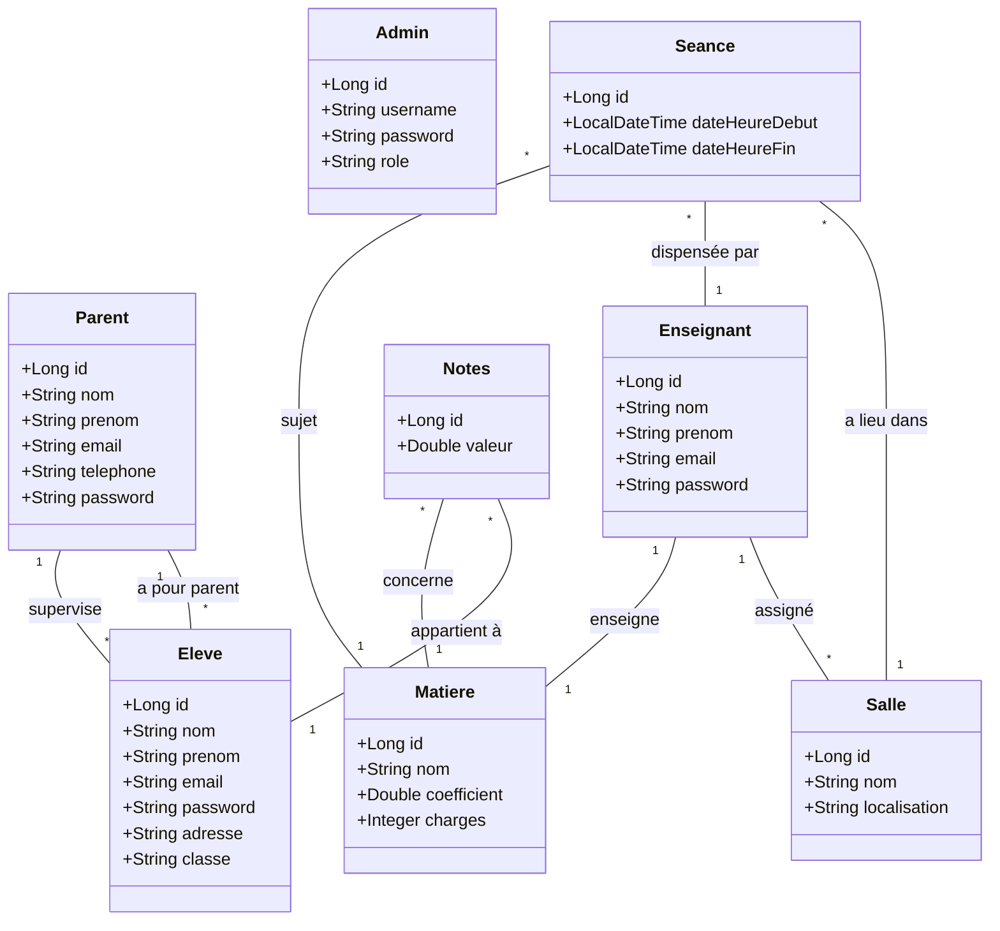

# 🎓 Apprenia - Gestion Scolaire (Backend)

Apprenia est une application complète de gestion pour établissements scolaires, permettant de piloter efficacement les ressources humaines, pédagogiques et logistiques.

## 🚀 Stack Technique
- **Backend** : Spring Boot 3, Java 17, Spring Security (BCrypt), Spring Data JPA.
- **Base de données** : MySQL / H2.
- **Frontend** : React (Vite).

---

## 🏗️ Analyse de l'Architecture Technique

Le projet suit une architecture multicouche standard pour assurer une séparation nette des préoccupations :

### 1. 📡 Controllers (`com.school.gestionscolarite.controller`)
- Gèrent les points d'entrée REST de l'API.
- Utilisent les services pour traiter la logique métier.
- Retournent des **DTOs** (Data Transfer Objects) pour masquer la complexité interne des entités.
- *Exemples* : `EleveController`, `NotesController`, `SeanceController`.

### 2. 🧠 Services (`com.school.gestionscolarite.service`)
- Centralisent la logique métier (calculs de moyennes, validations).
- Assurent le lien entre les contrôleurs et les dépôts de données.
- *Exemples* : `NotesService` gérant la persistance des évaluations.

### 3. 💾 Repositories (`com.school.gestionscolarite.repository`)
- Interfaces étendant `JpaRepository`.
- Fournissent les méthodes CRUD standards et des requêtes personnalisées.

### 4. 🧩 Entities (`com.school.gestionscolarite.entity`)
- Modèles de données mappés à la base de données via Hibernate.
- *Entités clés* : `Eleve`, `Enseignant`, `Parent`, `Matiere`, `Salle`, `Seance`, `Notes`.

---

## 📊 Modélisation (Mermaid)

### 🔹 Diagramme de Classe
Ce diagramme illustre la structure des données et les relations entre les différentes entités du système.



### 🔹 Diagramme de Cas d'Utilisation
Ce diagramme présente les interactions des différents acteurs avec le système Apprenia.

```mermaid
usecaseDiagram
    actor "Administrateur" as Admin
    actor "Enseignant" as Teacher
    actor "Élève" as Student
    actor "Parent" as Relation

    package Apprenia {
        usecase "Gérer Utilisateurs (Eleve/Prof)" as UC1
        usecase "Gérer Emploi du Temps (Séances)" as UC2
        usecase "Gérer Salles & Matières" as UC3
        usecase "Saisir & Modifier Notes" as UC4
        usecase "Consulter Notes" as UC5
        usecase "Consulter Planning" as UC6
        usecase "Suivre Progrès Enfants" as UC7
    }

    Admin --> UC1
    Admin --> UC2
    Admin --> UC3
    Admin --> UC4
    
    Teacher --> UC4
    Teacher --> UC6
    
    Student --> UC5
    Student --> UC6
    
    Relation --> UC7
    Relation --> UC5
```

---

## 🔐 Sécurité & Authentification
- Hachage des mots de passe avec **BCrypt**.
- Authentification via endpoints dédiés (`/api/auth/login`).
- Contrôle d'accès par rôles (`ADMIN`, `ENSEIGNANT`, `ELEVE`, `PARENT`).

## 🛠️ Installation
1. Configurer `src/main/resources/application.properties`.
2. Lancer via Maven : `./mvnw spring-boot:run`.
3. Frontend accessible sur `http://localhost:3000`.
